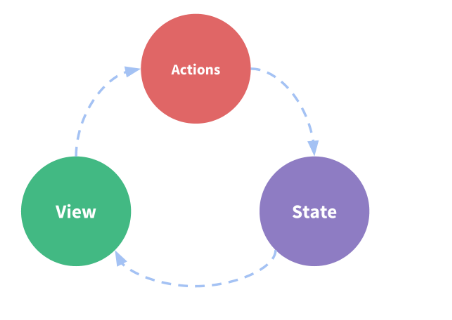
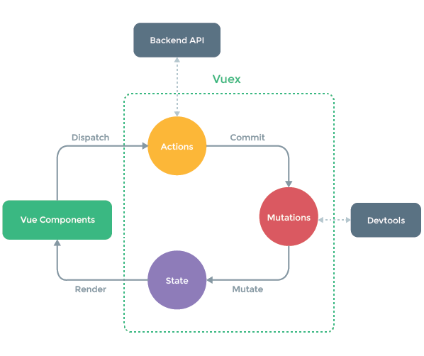

### Vue2.0中数据的vuex学习笔记

>vuex在官方介绍来看，它是一个专为vuejs管理数据状态的工具，使得数据在不同组件或者实例之间能达到共享，当我们存在不同的实例时，有需要操作共同的数据，父子组件参数的传递会使得数据异常雍肿，此时应该考虑vuex集中状态去管理数据，多个视图依赖同一组状态，多个组件达到共享状态，在本文中将言简意赅剖析使用vuex的入门技巧，以及自身对vuex的浅薄理解

* 如何克服vuejs的单向数据流壁垒

  

  这个图表明了vue是数据单向的流动，state是数据源，view是映射state到视图层的数据，action是响应用户事件触发改变state状态数据

  ```javascript

  var state = {
    	count:0 //state  数据源
  }
  var templateStr = "<p>{{count}}</p>";//view层，映射state数据
  //vm实例
  var vm = new Vue({
     el:"#id",//挂在Dom点
     data:state,
     template: templateStr,
     methods:{
       countFn(){  //actions  响应用户事件改变state数据源，从而改变视图 
         this.count++
       }
     }
  })
  ```

  从以上代码中我们可以看出，state数据源驱动视图，view层中的template模板响应state数据，countFn响应改变state数据。当遇到多个`vm实例`共享一个数据源时，此时这种单向数据源就容易被破坏。因此在vuex使用解决了该问题：

  * 多个视图依赖同一组状态
  * 不同视图组建需要共享一个状态

  vuex的思想就是共享组建状态，全局单例模式管理，隔离状态管理。

* vuex工作原理视图

  

  对应上面一张图，我们来看vuex是如何隔离状态管理达到数据共享的

  ```javascript
  //index.js
  //引入vue 和vuex
  import Vue from 'vue';
  import Vuex from 'vuex';
  import Index from '../components/index.vue';
  Vue.use(Vuex);//在实例Vuex插件前，必须利用Vue.use安装该插件

  const store = new Vuex.Store({
      state:{
          count:0,
          msg:'hello vue',
          dataList:[
              'html5','css3','react'
          ]
      },
      mutations:{//同步操作，直接操作state
          //add:state=>state.count++,
          // decrement:state=>state.count--
          // add(state){
          //     state.count++;
          //     console.log("==",store.state.count)
          // },
           add:function(state){
              state.count++;
          },
          decrement(state,parms){
              state.count--;
              console.log(this);
              console.log('parms=',parms)
          }
      },
      getters:{
          getdataList(state){
              return state.dataList
          }
      },
      actions:{//异步操作multation,不是直接操作state
          add(context){//这个add与mutations中的add相同
              context.commit('add');
              console.log(context)
          }
      }
  })
  var vm = new Vue({
      el:'#main',
      data:{
          message:"hello js"
      },
      store,//将store注入子组件中
      template: "<Index />",
      components:{Index},
      mounted(){
          console.log('hello vuejs');
      }
  })
  ```
  在上述代码中可以将store拆分几个部分:

  * 实例化store仓库

  ```javascript
  var store = new Vuex.Store(data);
  ```

  * 响应data集中管理数据
  ```javacript
  var data = {
    state:{
    	count: 0,
      datalist:[]
    },
    mutations:{
      add(state){
        state.count++;//操作state中的数据
      }
    },
    getters:{//相当于计算属性，将state中的指定数据缓存起来，在子组件中通过this.$store.getters.datalist获取state中的指定数据
      datalist(state){
        return state.datalist
      }
    },
    actions:{
      add(context){	//这个add必须要与mutations中方法相同,add中接收一个参数context，该参数可以访问 commit,dispatch,getters，                             //rootGetters,rootState，state
        context.commit('add')
      }
    }
  }
  ```

  * 将store对象注入vm实例的所有组件中，所有的子组件都可以享用store中的数据

   ```javascript
  var vm = new Vue({
    el:"#id",
    store,
    template:"<Index />",
    components:{Index}
  })
   ```

* Index.vue

  ```javascript
  <template>
      <div class="indexmain">
          <input type="button" value="添加" @click="add">
          {{count}}
          <input type="button" value="减少" @click="reduce"/>
          {{msg}}
          <div class="datalist">
              <p v-for="(item,idx) in dataList" :key="idx">{{item}}</p>
          </div>
      </div>
  </template>
  <script>
  import {mapState} from 'vuex';
  //利用mapState辅助生成计算属性
  export default {
    data(){
        return{

        }
    },
    methods:{
        add(){
            //console.log(111);
            //this.$store.commit('add');通过commit去响应mutation中的state
            this.$store.dispatch('add',{add:10,age:30});//异步actions，通过dispatch去触发mutations中的方法
            console.dir(this);
            console.log(this.$store.state.count)
        },
        reduce(){
             this.$store.commit('decrement',{num:10,money:100})
        }
    },
  //   computed:{
  //       count(){//以计算属性返回某个状态
  //           return this.$store.state.count
  //       }
  //   }
        //mapState：统一管理state，通过this.$store.count获取数据
      computed:mapState({
          count:function(){
              return this.$store.state.count
          },
          msg:function(){
              return this.$store.state.msg
          },
          dataList:function(){
              return this.$store.getters.getdataList
          }
      })
  }
  </script>
  ```


在template中的view层，响应数据主要是通过computed计算属性去更新视图的，上面注释部分也可以响应模板中的数据，还可以用mapState去管理计算属性。

在这个组件中,事件触发响应store中的数据，主要在methods中通过commit提交mutations中的方法去响应state中的数据`this.$store.commit('add')`

对应mutations设置(在mutations中的必须同步的)

```javascript
mutations:{
  add(state,parms){
    	state.count++;
    	//parms  commit提交传过来的数据参数
  }
}
```


另一种是异步响应，主要是actions中管理，在子组件中，调用dispatch去分发mutations中方法 `this.$store.dispatch('add')`,对应的actions设置

```javascript
actions:{
  add(context){
     context.commit('add');
  }
}
```

在Index.vue中有mapState,集中管理computed,mapState传入一个对象，键值队方式罗列属性名,count、msg，dataList就是模板中计算属性值

```javascript
computed:mapState({
  count:function(){
          return this.$store.state.count
       },
   msg:function(){
       return this.$store.state.msg
    },
    dataList:function(){
     return this.$store.getters.getdataList
    }
})
```

本文小结：

* vuex是一个专为vue统一管理数据源的工具，能使得不同实例或者组件之间达到数据共享
* vuex中的state状态存储是响应式的，vue组件从store中获取的状态的时，如果store发生变化，则相应组件也会发生变化
* 在store中，我们是通过mutations中方法去间接改变state，在组件中获取数据，通过this.$store.state.count去获取，响应state数据源变化，主要是通过commit去提交的，this.$$store.commit("add");
* 通常在mutations中改变state时同步的，在组件中通过commit提交
* 如果想异步改变状态，则要在actions中做异步处理，组件中通过dispatch派发，this.$store.dispatch('add");
* 参考官网[vuex](https://vuex.vuejs.org)

本案例[demo]()

```javascript
npm install 
npm run dev 启动服务，浏览器运行  http://localhost:8012/
```


