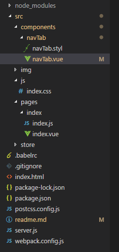

### HTML5的history的api详解

> html5中单页开发SPA常用开发思路是利用路由去做无刷新读取数据，而路由是根据浏览器的hash值去切换当前页面显示的对应内容，不会因为用户操作而刷新整个页面，重新加载整个页面,本文主要针对history.replaceState的详解。

```javascript
//history下的api
for(var i in history){
  console.log(i)
    /*length
    VM108:2 scrollRestoration
    VM108:2 state
    VM108:2 go
    VM108:2 back
    VM108:2 forward
    VM108:2 pushState
    VM108:2 replaceState
   */
}
```

* 监听hashchange事件

```javascript
window.addEventListener("hashchange",function(e){
	var event = e||window.event;
  	var oUrl = '';
    event.oldURL.replace(/#(\S*)/g,function(a,b,c,d){
      oUrl = b;
      console.log("oUrl",oUrl)
    });
    var nUrl = '';
    event.newURL.replace(/#(\S*)/g,function(a,b,c,d){
      nUrl = b;
      console.log("nUrl",nUrl);
    })
    if(nUrl == ''){
      alert(111);
    }
})
```

  在上述监听hashchange事件中，回调函数中，会触发，在hash值不断切换的过程中，nUrl会记录当前状态的hash值，oUrl会记录上一次的hash值，因此可根据该变化的hash值，对页面的数据做相应的操作。

* history.replaceState
```javacript
if(history.replaceState){
  var random = Math.ceil(Math.random()*10)
  history.replaceState({},'',"#"+hash)
}
```

该方法会是在强制刷新当前页面时，在你地址的Url后面新增一个随机数的hash值，因此在强制刷新后，仍然可以改变hash值，你可对应需要的hash值变化，再继续操作对应的dom.

具体实例




```html
//html
<!DOCTYPE html>
<html lang="en">
	<head>
		<meta charset="UTF-8">
		<meta name="viewport" content="width=device-width, initial-scale=1.0">
		<meta http-equiv="X-UA-Compatible" content="ie=edge">
	</head>
	<body>
		<div id="main">
			
		</div>
      	<!--绝对路径，引入入口文件-->
		<script type="text/javascript" src="/assets/dist/index.js"></script>
	</body>
<html>
```

* webpack.cobfig.js

```javascript
let path = require('path');
let ExtractTextPlugin = require('extract-text-webpack-plugin');
let webpack = require('webpack');

console.log("dirname",path.join(__dirname,'/src/'))
module.exports = {
	entry: {
		'index': [path.join(__dirname, '/src/pages/index/index.js')],
	},
	output: {
	    path: path.join(__dirname, '/assets/dist'),//运行webapck -w 生成后的目录
		filename: '[name].js'//生成指定的文件目录文件名
	},
	module: {
	  	loaders: [
		  	{
		  	    test: /\.css$/,
		  	    exclude: /src\/libs/,
		  	    loader: ExtractTextPlugin.extract({ 
					fallback: 'style-loader', 
					use: ['css-loader','stylus-loader'] 
				})
		  	},
			{
				test: /\.js$/,
				loader: 'babel-loader',
				exclude: /node_modules/
			},
			{
				test: /\.styl$/,
				loader: ExtractTextPlugin.extract({ 
					fallback: 'style-loader', 
					use: ['css-loader','postcss-loader','stylus-loader'] 
				})
			},
			{
			    test: /\.(png|jpg|gif|woff|woff2)$/,
			    loader: 'url-loader?limit=5000&name=img/[name]-[hash:6].[ext]'
			},
			{
			    test: /\.(mp4|ogg|svg)$/,
			    loader: 'file-loader?name=img/[name]-[hash:6].[ext]?'
			},
			{
                test: /\.vue$/,
                loader: 'vue-loader'//加载vue
            },
	  	]
	},
	resolve: {
		extensions: ['.js', '.vue', '.json'],
		alias: {
			'vue$': 'vue/dist/vue.esm.js',//编译vue文件,
			"@default":path.join(__dirname,'/src/')//共用路径
        }
	},
	//插件
	plugins: [
		new ExtractTextPlugin("[name].css"),
		// 压缩
		new webpack.optimize.UglifyJsPlugin(),//压缩js,
	],
	externals: {//这个配置，引入的jquery不会被编译在webpack中
		
	}
}
```

  module中的loader模块主要涉及加载编译的一些依赖js，css以及一些图片

  plungins是配置一些常用插件

  entry:入口文件

  output:输出文件

  externals:这个是设置内置共用的js模块，不会打包到index.js中去

* server.js

```javascript
const path = require("path");
const express = require("express");
const webpack = require("webpack");
let webpackDevMiddleware = require('webpack-dev-middleware');
const app = express();

const port = 8012;

app.use(express.static(path.join(__dirname, './')));//设置中间件，静态资源入口根目录
let complier = webpack(require('./webpack.config.js'));

app.use(webpackDevMiddleware(complier,{
	
	publicPath: '/assets/dist',//这里设置共用访问路径 这里首页Index.html的路径就是因为这里设置的原因
}))
app.listen(port,function(){
	console.log('server is now runing on '+port);
})
```

* index.js

```javascript
import Vue from 'vue';

import Index from './index.vue';
import store from '@default/store/store.js';
import style from '@default/components/navTab/navTab.styl'
var vm = new Vue({
    el:'#main',//挂在dom节点
    data:{
        message:"hello js"
    },
    store,//将store注入子组件中
    template: "<Index />",
    components:{Index},
    mounted(){//首页渲染的加载的时候会触发该函数
        console.log('hello vuejs');
    }
})
```

  index.vue

```javascript
<template>
    <div class="indexmain">
        <div class="navtab">
            <nav-tab :tablist="navTablist" @hashchange="hashchange"></nav-tab>
        </div>
        <div class="cnt">
           <p  v-for="(item,idx) in classList" :key="idx" :class="item" v-if="hash==item">{{item}}</p>
        </div>
        <!-- <input type="button" value="添加" @click="add">
        {{count}}
        <input type="button" value="减少" @click="reduce"/>
        {{msg}} -->
        
    </div>
</template>

<script>

import {mapState} from 'vuex';
import navTab from '@default/components/navTab/navTab.vue';//引入其他组件
//利用mapState辅助生成计算属性
export default {
  data(){
      return{
          navTablist:this.$store.getters.getdataList,
          classList:['html5',"css3","react",'nodejs'],
          hash:'html5'
      }
  },
  components:{navTab},
  methods:{
      add(){
          //console.log(111);
          //this.$store.commit('add');通过commit去响应mutation中的state
          this.$store.dispatch('add',{add:10,age:30})
          console.dir(this);
          console.log(this.$store.state.count)
      },
      reduce(){
           this.$store.commit('decrement',{num:10,money:100})
      },
    //自定义方法
      hashchange(pames){
         this.hash = pames;
         console.log("pames",pames);  
      }
  },
    computed:mapState({
        count:function(){
            return this.$store.state.count
        },
        msg:function(){
            return this.$store.state.msg
        },
        dataList:function(){
            return this.$store.getters.getdataList
        }
    }),
    //页面初始化实例或者刷新当前网页时，会重新加载这个方法
    mounted(){
        console.log("首次刷新加载")
    },
    //data发生变化时，就会触发该函数
    updated(){
        console.log(Math.random()*10)
       //this.hashchange();
    }
}
</script>
<style lang="stylus">
   .html5,.css3,.react,.nodejs{
       width:100%;
       heigh:60px;
       background:red;
   }
</style>
```

在上述代码块中，主要用到了vue的自定义组件模块，以及循环指令，自定义事件，以及自定义属性props的传值，当父组件传入子组件数据时直接`:tablist="navTablist"` 方式传入子组件中，而navTablist可以是data中的数据，子组件中获取该数据直接以props方式接收，`props:['tablist']`

涉及自定义事件，父组件中自定义事件`@hashchange="hashchange"` ，子组件中触发，`this.$emit('hashchange',data)`,这里的data可以向父组件的自定义事件中传入数据。要注意的是update(){}这个生命周期函数，当data发生变化时，都会调用该函数。

navTab.vue

```javascript
<template>
    <div class="nav-top">
        <p>
            <a :href="'/#'+item" @click="tabClickfn(item)" :alt="item" v-for="(item,idx) in datalist" :key="idx" :class="hash == item?'active':''">{{item}}</a>
        </p>
    </div>
</template>
<script>
export default {
 
  props:['tablist'],//父组件传入子组件中的自定义属性
  data(){
      return{
          datalist: this.tablist, //父组件往子组件,
          hash: "html5",
          isActive: false
      }
  },
  methods:{
      tabClickfn(item){
          this.hash = item;
          this.$emit("hashchange",item);//触发父组件中的自定义事件   
      },
      hashChange(){
          let self = this;
          window.addEventListener("hashchange",function(e){
         //console.log(e)
            var event = e||window.event;
            var oUrl = "";
            event.oldURL.replace(/#(\S*)/g,function(a,b,c,d){
                oUrl = b;
                console.log("oldUrl",a,b,c,d);//oldUrl #css3 css3 22 http://localhost:8012/#css3
            })
            var nUrl = '';
            event.newURL.replace(/#(\S*)/g,function(a,b,c,d){
                nUrl = b;
                console.log("newUrl",a,b,c,d);//newUrl #react react 22 http://localhost:8012/#react
            });
            if(nUrl == ''){
                console.log(1111)
            }
            self.$emit('hashchange',nUrl);
            self.hash = nUrl;
      })
    },
    getHash(){
        return window.location.hash.replace(/(^#)/,"")
    },
    changeTabColor(url){
        if(url == this.getHash()){
            this.isActive = true;
        }else{
            this.isActive = false;
        }
    },
    curentHash(){
        if(history.replaceState){
        var hash = this.getHash();
        var type = "";
        switch(hash){
            case "":
                hash = "html5";
                break;
            case "html5":
                alert("html5");
                type = 1;
            break;
            case "css3":
                alert("css3");
                type = 2;
            break;
            case "react":
                alert("react");
                type = 3;
            break;
            case "nodejs":
                alert("nodejs");
                type = 4;
            break;
            default:break;
        }
        //history.pushState({},'',hash+".html");//会在浏览器的地址上修改其url的值
        //history.replaceState({},"","#"+hash+type);重新刷新页面会向hash值中添加一个type

        history.replaceState({},"","#"+hash)

        return hash;
      }
    }
  },
  //mounted只会调用一次
  mounted(){
      console.log("11111")
     this.hashChange();
     var curenthash = this.curentHash();
     this.hash = curenthash;
     this.$emit('hashchange',curenthash)
  }
}
</script>
<style lang="stylus">
*{padding:0px;margin:0px;}
.nav-top{
    p{
        display:flex;
        justify-content center;
        text-align:center;
        flex-direction:row;
        a{
            display:block;
            flex:1;
           &.active{
               background:green;
           }
        }
    } 
}
</style>
```

在上述代码中，主要涉及history.pushState()与history.replaceState()

```javascript
histtory.pushState("状态对象",'标题',url);
//history.pushState({},"","#333")  会在浏览器url中创建了一个新的hash值,不会触发到hashchange事件
```

```javascript
history.replaceState({},"","#4444");//修改当前的hash值
```

* 总结

  1:主要是针对history.replaceState与history.pushState这两个方法进行了梳理

  2：路由的思想是根据hash值去对应请求相应的数据，无刷新，且能够监控返回键，对dom页面的显示隐藏

  3：hashchang事件下有个event.oldURL与event.newURL可以监控上一次和当前的hash值


