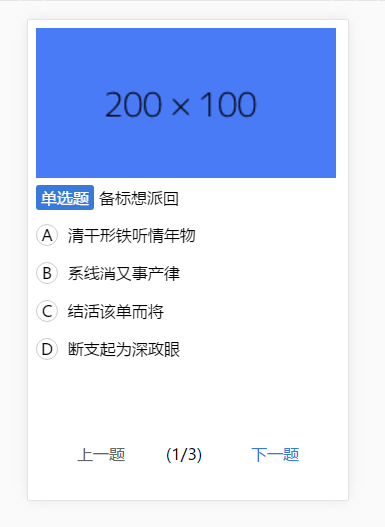
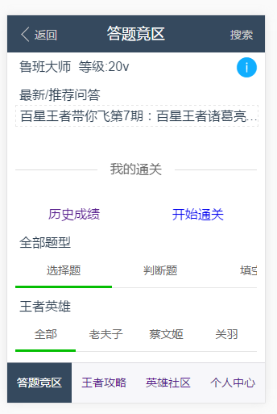

# 王者宝典

> 该项目主要利用vue-cli脚手架工具快速构建多页面工具，项目中用到了vue2，vux,mockjs，express,vue-router,webpack2，该项目在vue-cli的基础上将vue-cli单页应用改造成了一个多页应用，主要参照简书[使用Vue-cli搭建多页面应用时对项目结构和配置的调整](https://www.jianshu.com/p/0a30aca71b16)一文，在该项目上，主要涉及热加载(webpack-hot-middleware),使用了less编译，涉及模拟接口proxyTable的设置跨域，以及vuex集中管理数据，父子组件props的通信，以及vue-router单页路由实现，vue-cli主要简化了复杂配置工具的操作，解放你繁琐的工具配置。

## 项目结构

```javascript
|----build //线上打包代码
|----config//生产环境和线上环境配置
|----mock//mockjs模拟接口的数据
      |----community.js//社区接口
      |----competitive.js//答题竞区接口
      |----heroAll.js//英雄列表接口
      |----percenter.js//个人中心接口
      |----mockserver.js//启动mockjs服务的数据
|----src
	  |----commons//共用js模块
      |----compoments//共用的自定义组件模块
      |----page//多页应用，跳转的相关页面
      |----store//状态数据管理
      |----styles//公用页面样式
|-----static
|-----test
|-----index.html//首页
|-----package.json//依赖配置

```


```javascript
## Build Setup
 ``` bash
# 安装依赖 install dependencies
npm install

# 启动服务 serve with hot reload at localhost:8084
npm run dev

# 运行模拟数据 server width mock data at localhost:8085
npm run mock

# 线上打包代码 build for production with minification
npm run build

# build for production and view the bundle analyzer report
npm run build --report

# 单元测试 run unit tests
npm run unit

# run e2e tests
npm run e2e

# run all tests
npm test
```

For detailed explanation on how things work, checkout the [guide](http://vuejs-templates.github.io/webpack/) and [docs for vue-loader](http://vuejs.github.io/vue-loader).

## 部分页面

